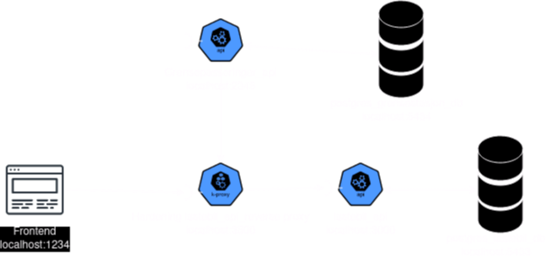

# Blackbox



1 enkel frontend, 2 restapi med hver sin postgresdatabase.
Lastebil_api er et restapi'et med reverse-proxy og er beskrevet mer her: [Hardened_lastebil_api_README.md](Hardened_lastebil_api_README.md).
Det andre api'et er et enkelt java-api med 2 endepunkter og er mer beskrevet i [java-app/README.md](java-app/README.md)

## Nødvendig programvare  

make  
docker  
docker-compose  

## Hvordan kjøre det  

```shell
make start  # Starter alle applikasjonene og databasene i docker    
make stop   # Stopper alle applikasjonene    
```


